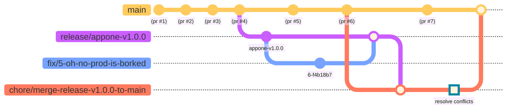

# Merge Release Hotfix

<a href="https://github.com/airtonix/merge-release-hotfix-action/actions/workflows/test.yml?branch=main&event=push">
  
</a>

> Get your release hotfixes back into your mainline without tainting your release branches.


If you follow "something" like gitlab flow with environment branches and: 

- 👍️ You think cherrypick based deployment sucks.
- 🚢 you create release snapshot branches that you deploy.
- 🏗️ you fix and redeploy those release branches with hotfix PRs.
- 🙄 Your mainline development branch moves blazingly fast.
- 🤤 Your team want your hotfixes. Yesterday.

Then ...


[jump to usage](#usage)

## Dude, what?

Given a target branch `main`, a source branch `release/appone-v1.0.0` and some title, body and branch name templates like 
```yml
branch: "merge-hotfix/{{source}}-to-{{target}}"
title: "merge-hotfix: {{source}}"
body: "merge hotfixes from {{source}} to {{target}}"
```

This action, when run will do the following:
1. Looks for an existing branch named `merge-hotfix/release-appone-v1-0-0-to-main`
    - if it doesn't exist then it is created based on `release/appone-v1.0.0`
    - if it exists then `release/appone-v1.0.0` is merged into `merge-hotfix/release-appone-v1-0-0-to-main`
2. Creates a PR with
    - a target of: `main`
    - title: `merge-hotfix: release/appone-v1.0.0`
    - body: `merge hotfixes from release/appone-v1.0.0 to main`
3. From here you can:
    - resolve merge conflicts between `main` and `merge-hotfix/release-appone-v1-0-0-to-main`
    - merge futher changes into `merge-hotfix/release-appone-v1-0-0-to-main`


It looks like this:



## Why not just cherry pick from `main` ? 

Probably because:

- you squash your PRs into `main`, so that 
- your developers don't have to be so worried about individual commits in their PRs

but more importantly: 

- Fixing a bug should be done in the most accurate reflection of the environment in which the bug was discovered.
- If you do this in the development branch, your assumptions about how to fix the bug will be affected by all the other changes that may have drastically changed since you last released.
- It's easier to just stick to simpler mechanics of "Create branch from X, make PR, merge to X"


## Usage

```yml
---
name: "merge-release-hotfix"

"on":
  push:
    branches:
      - release/*

#
# only run one at a time
concurrency:
  group: ${{ github.workflow }}-${{ github.ref }}

jobs:
  MergeReleaseHotfix:
    
    runs-on: ubuntu-latest

    permissions:
      contents: write
      pull-requests: write
      issues: write

    steps:
      - uses: actions/checkout@v3

      - name: Merge
        uses: "@airtonix/merge-release-hotfix@v0.0.1"
        with:
          GithubToken: ${{secrets.GITHUB_TOKEN}}
          SourceRef: ${{github.ref_name}}
          TargetRefs: main

```

